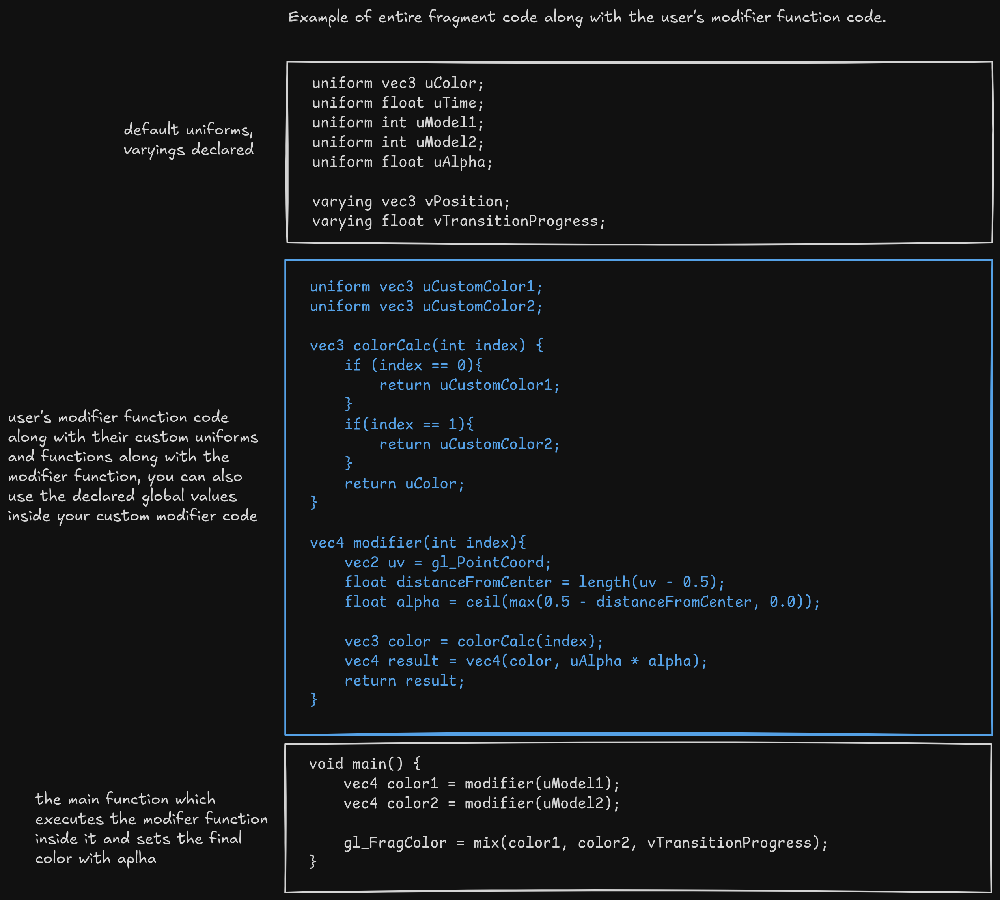
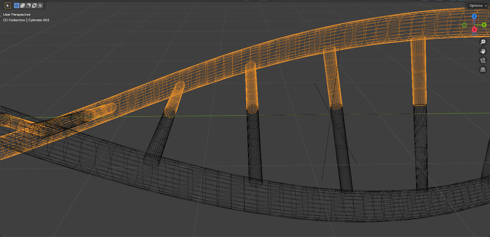
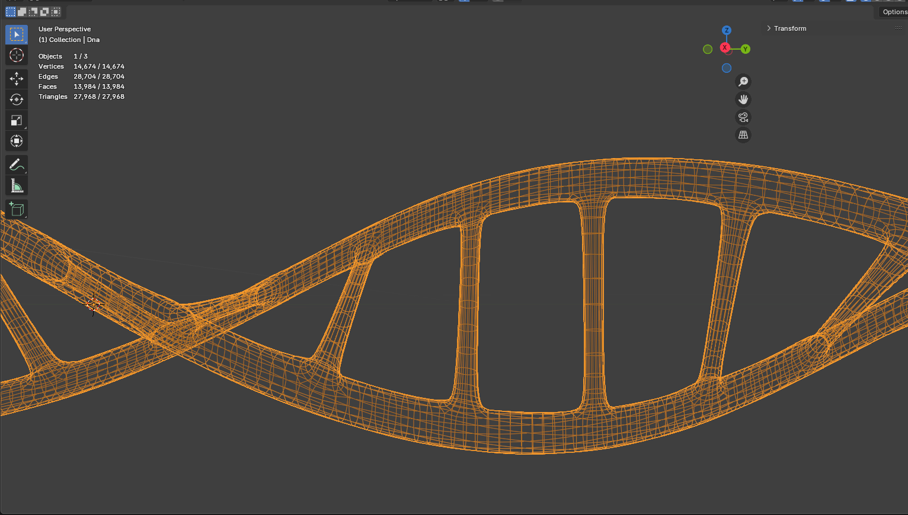

# Introduction

R3FPointsFX is a powerful, flexible React component designed for rendering high-performance, customizable particle effects in 3D scenes using [React Three Fiber](https://r3f.docs.pmnd.rs/). Built with creative and interactive web experiences in mind, R3FPointsFX bridges the gap between ease of use and advanced shader-driven visual effects — allowing both rapid prototyping and precise, production-ready control.

\
With a single, declarative component, you can:

- Animate thousands of particles with smooth transitions between different shapes or models.
- Inject custom GLSL shaders for unique vertex and fragment effects.
- Tweak colors, attributes, and uniforms to fit your creative vision.
- Leverage efficient GPU-driven animation for complex visuals without sacrificing performance.

\
Whether you're building data-driven visualizations, interactive art, science demos, or playful web interfaces, **R3FPointsFX** helps you achieve stunning, high-FPS visuals — all within the React paradigm.

# Features

- **Imperative Ref Control**: Access transitions and particle mesh directly via a ref, no React re-renders needed.

- **Flexible Particle Generation**: Sample particles from any mesh surface, independent of original vertex count, or use exact mesh vertices when desired.

- **Easy Customization**: Modify appearance, transitions, and motion with **modifier functions**, pass your own custom shader uniforms, and attributes.

# Quick Start

Install using npm:

```bash
npm i r3f-points-fx
```

Basic usage, a transition cycle, duration 2 seconds, wait for 2 seconds after a transition:

```tsx
import { useGLTF } from '@react-three/drei'
import { useFrame } from '@react-three/fiber'
import type { R3FPointsFXRefType } from 'r3f-points-fx'
import { R3FPointsFX } from 'r3f-points-fx'
import * as React from 'react'
import * as THREE from 'three'
import type { GLTF } from 'three-stdlib'

const TRANSITION_DURATION = 2
const WAIT_DURATION = 2

const SPHERE = new THREE.Mesh(
  new THREE.SphereGeometry(1.5, 32, 16),
  new THREE.MeshBasicMaterial(),
)

export const Particles = () => {
  // example of with loading gltf models
  const { nodes } = useGLTF('suzanne.glb') as GLTFResult

  const fxRef = React.useRef<R3FPointsFXRefType>(null)
  const start = React.useRef(0)
  const modelA = React.useRef(0)
  const modelB = React.useRef(1)

  const meshes = [nodes.Suzanne, SPHERE]

  // Ensure the update progress is called exactly once per frame
  // or transition will glitch.
  useFrame(({ clock }) => {
    if (start.current === 0) {
      start.current = clock.elapsedTime
    }

    const elapsed = clock.elapsedTime - start.current

    const progress = Math.min(
      Math.max(0, (elapsed - WAIT_DURATION) / TRANSITION_DURATION),
      1,
    )

    if (progress >= 1) {
      modelA.current = modelB.current
      modelB.current = (modelB.current + 1) % meshes.length

      fxRef.current?.setModelA(modelA.current)
      fxRef.current?.updateProgress(0)
      fxRef.current?.setModelB(modelB.current)
      start.current = 0
    } else {
      fxRef.current?.updateProgress(progress)
    }
  })

  return (
    <R3FPointsFX
      ref={fxRef}
      scale={[2.5, 2.5, 2.5]}
      position={[0, 0, 0]}
      modelA={modelA.current} // set value initally, later control using ref
      modelB={modelB.current}
      pointsCount={15000}
      pointSize={0.4}
      organizedParticleIndexes={[0]} // particles will arrange at exact vertex positions for suzanne mesh
      models={meshes}
      baseColor={new THREE.Color('#fff')}
      sizeAttenutation={true}
    />
  )
}

type GLTFResult = GLTF & {
  nodes: {
    Suzanne: THREE.Mesh
  }
  materials: object
}
```

<ExamplesSandpack scene='scene1' />

# API Reference

## Methods exposed by the `ref`:

| Method | Usage | Returns |
| --- | --- | --- |
| `setModelA(modelIndex: number)` | `pointsRef.current.setModelA(index:number \| null)` | void |
| `setModelB(modelIndex: number)` | `pointsRef.current.setModelA(index:number \| null)`  | void |
| `updateProgress(progress: number)` | `pointsRef.current.updateProgress(progress:number)` | void |
| `updateTime(time: number)` | `pointsRef.current.updateTime(time:number)` | void |
| `getPointsMesh()` | `pointsRef.current.getPointsMesh()` | `THREE.Points` |
| `getSimulationMesh()` | `pointsRef.current.getSimulationMesh()` | `THREE.Mesh` |

> [!IMPORTANT]
> The `updateTime` method is exposed so that the user updates the `uTime` (already declared) uniform in the shader. This uniform is not automatically updated by the component, as it is not being used in the defualt shader code. If you decide to use it inside your modifier functions, you will need to call this method to update the time value.

## Props
| Prop | Type | Default | Description |
| --- | --- | --- | --- |
| models* | `THREE.Mesh[]` | -  | Array of meshes to sample particles from |
| pointsCount | `number` | `10000` | Number of particles to render |
| modelA | `number \| null` | `null` | Index of the model to use as first model for particle transition, nothing will be visible if value is `null` |
| modelB | `number \| null` | `null` | Index of the model to use as second model for particle transition, nothing will be visible if value is `null` |
| pointSize | `number` | `0.1` | Size of each particle |
| baseColor | `THREE.Color` | `new THREE.Color('#fff')` | Base color applied to all the particles, you can customize colors by passing your own color uniforms and a fragment modifier function |
| alpha | `number` | `1` | Opacity applied to all the particles. (Can be customized per particle by using fragment modifier function) |
| sizeAttenutation | `boolean` | `true` | Whether to apply size attenuation to particles, making them appear smaller with distance from the camera |
| blending | `THREE.Blending` | `THREE.AdditiveBlending` | Blending mode for the particles |
| organizedParticleIndexes | `number[]` | `[]` | Array of indexes of particles that will be arranged at exact vertex positions of the mesh, should be used for meshes having vertex count less than or equal to the `pointsCount` |
| uniforms |  `Record<string, validUniformType>`  | `undefiend` | The custom uniforms which you can pass additionally, declare and use them in the modifier functions |
| attributes | `attribute[]` | `undefined` | The custom attributes which you can pass additionally, declare and use them in the **vertex modifier function** |
| vertexModifier | `string` | `undefiend` | Vertex modifer function |
| fragmentModifier | `string` | `undefiend` | Fragment modifer function |
| progressModifer | `string` | `undefined` | Progress modifier function, used to modify the transition progress between modelA and modelB |

> [!IMPORTANT]
> Apart from the above props, all the props accepted by the `<points>` component in react three fiber can be passed, like `position`, `rotation`, `scale`, etc. These props will be applied to the `THREE.Points` mesh created.

# Customization
Points FX uses some complex shader code to achieve the particle effects. To provide a very flexible way of controlling the look and feel of the particles, customization has to be offered using modifier functions. These functions are written in GLSL and allow you to modify the vertex (to size, position, etc.) and fragment shaders (to customize colors, alpha, shape of individual particles), as well as the transition progress. It is highly recommended to have a basic understanding of GLSL shader programming to effectively use these features and to have a look at the examples provided. 

> [!IMPORTANT]
> Your custom modifier functions will be injected into the shader code, ensure that these props (`vertexModifier`, `fragmentModifier`, `progressModifier`) are passed as strings, and the code is valid GLSL. These props should not change during the rendering, as they are injected into the shader code.

## Using the Modifier Functions
Default structure of the modifier functions are provided below, you should not change the **function name** or the **return value type** of these functions, but you can modify the body of the function to achieve the desired effect, you can even declare and use your own uniforms and attributes inside the modifier function string. Apart from that the default uniforms and attributes (as they are declared globally in the shader code) are also available to use inside the modifier functions. This shader code runs on every frame, parallely for each particle on the GPU.

#### Vertex Modifier Function
```glsl
/**
* VertexProperties is a struct that contains the properties of the vertex
* dont redeclare this struct, it is already declared in the shader code
* you can use this struct to return the modified vertex properties
*
* struct VertexProperties {
*  vec3 position;
*  float pointSize;
*  float progress;
* }
*
*/
VertexProperties modifier(vec3 pos, float progress){
  VertexProperties result;
  result.position = pos;
  result.pointSize = uPointSize;
  result.progress = progress;

  return result;
}
```

#### Fragment Modifier Function
```glsl
// index is the current model's index in model array passed
vec4 modifier(int index){
// use gl_PointCoord and alpha to control the shape
// by default particle shape is circle
  vec2 uv = gl_PointCoord;
  float distanceFromCenter = length(uv - 0.5);
  float alpha = ceil(max(0.5 - distanceFromCenter, 0.0));

  vec3 color = uColor;
  vec4 result = vec4(color, uAlpha * alpha);
  return result;
}
```

#### Progress Modifier Function
```glsl
// origin and target are the positions of the particles in modelA and modelB respectively
// progress passed to this function is increasing linearly from 0 to 1
// you can use this function to modify the progress (ex: cubic bezier function) value based on your requirements
float progressModifier(vec3 origin, vec3 target, float progress){
  return progress;
}
```

### Global Uniforms, Attributes and Varyings available in each Modifier Function
#### Vertex Modifier Function

```glsl
/* 
 * data texture containing positions and progress. 
 * This texture has 4 channels per pixel, where first 3 channels are position (x, y, z) and the 4th channel is progress value.
 * The progress values is the computed value by the progress modifier function. 
*/
uniform sampler2D uPosition;

/*
 * Time value, if consumed, you need to update this value using the `updateTime` method exposed by the ref.
*/
uniform float uTime;

/*
 * vec2 containeing the width at x and height at y of the viewport.
*/
uniform vec2 uViewPort;

/*
 * Device pixel ratio, the same which is set in the `Canvas` component of react-three-fiber.
*/
uniform float uDpr;

/*
 * point size of the particles, this value is same as the `pointSize` prop passed to the component.
*/
uniform float uPointSize;

/*
 * index of a mesh in the mesh array, modelA in current transition
*/
uniform int uModel1;

/*
 * index of a mesh in the mesh array, modelB in current transition
*/
uniform int uModel2;

/*
 * varying to pass the position of the particle to the fragment shader
*/
varying vec3 vPosition;
/*
 * varying to pass the progress of the particle to the fragment shader
*/
varying float vTransitionProgress;
```

#### Fragment Modifier Function
```glsl
/*
 * base color of the particles, this value is same as the `baseColor` prop passed to the component.
*/
uniform vec3 uColor;

/*
 * Time value, if consumed, you need to update this value using the `updateTime` method exposed by the ref.
*/
uniform float uTime;

/*
 * index of a mesh in the mesh array, modelA in current transition
*/
uniform int uModel1;

/*
 * index of a mesh in the mesh array, modelB in current transition
*/
uniform int uModel2;

/*
 * alpha value of the particles, this value is same as the `alpha` prop passed to the component.
*/
uniform float uAlpha;

/*
 * varying to receive the position of the particle from the vertex shader
*/
varying vec3 vPosition;
/*
 * varying to receive the progress of the particle from the vertex shader
*/
varying float vTransitionProgress;
```

#### Progress Modifier Function
```glsl
/*
 * Time value, if consumed, you need to update this value using the `updateTime` method exposed by the ref.
*/
uniform float uTime;

/*
 * index of a mesh in the mesh array, modelA in current transition
*/
uniform int uModel1;

/*
 * index of a mesh in the mesh array, modelB in current transition
*/
uniform int uModel2;
```

If you want to have a deeper understanding of how these modifier functions work and how overall shader code looks, you can refer to the original shader code files:
- [PointsVertexShader.ts](https://github.com/VedantSG123/R3FPointsFX/blob/main/lib/R3FPointsFX/shaders/PointsVertexShader.ts)
- [PointsFragmentShader.ts](https://github.com/VedantSG123/R3FPointsFX/blob/main/lib/R3FPointsFX/shaders/PointsFragmentShader.ts)
- [FBOfrag.ts](https://github.com/VedantSG123/R3FPointsFX/blob/main/lib/R3FPointsFX/shaders/FBOfrag.ts)
- [FBOvert.ts](https://github.com/VedantSG123/R3FPointsFX/blob/main/lib/R3FPointsFX/shaders/FBOvert.ts)



# Performance and Best Practices
- Follow the performance guidelines of [React Three Fiber](https://r3f.docs.pmnd.rs/advanced/pitfalls) to ensure smooth rendering.
- This library gives the entire control of particle transition to the user exposed via the ref methods, so ensure that you are not creating a race condition where the `updateProgress` method is called multiple times in a single frame, this can lead to glitches in the transition.
- Ensure that any of the important props are not reactively changing during the rendering, as this can lead to unnecessary re-renders and performance issues. For example, `modelA`, `modelB`, `pointsCount`, etc. should not change frequently. For changing the model during the transition, use the `setModelA` and `setModelB` methods exposed by the ref.
- The output will be best if the mesh is not very complex, as the particles are sampled from the mesh surface or mesh vertices. Ensure a uniform mesh topology for best results. Use software like [Blender](https://www.blender.org/) or [MeshLab](https://www.meshlab.net/) to simplify, decimate, clean the mesh if needed.

Example of a bad mesh (has protruding vertices into the mesh body, not uniform):


Example of a good mesh (uniform, no protruding vertices):


# References and Inspiration
[Maxime Heckel's blog on particles in react three fiber](https://blog.maximeheckel.com/posts/the-magical-world-of-particles-with-react-three-fiber-and-shaders/)

[FBO particles – Youpi ! (barradeau.com)](https://barradeau.com/blog/?p=621)

